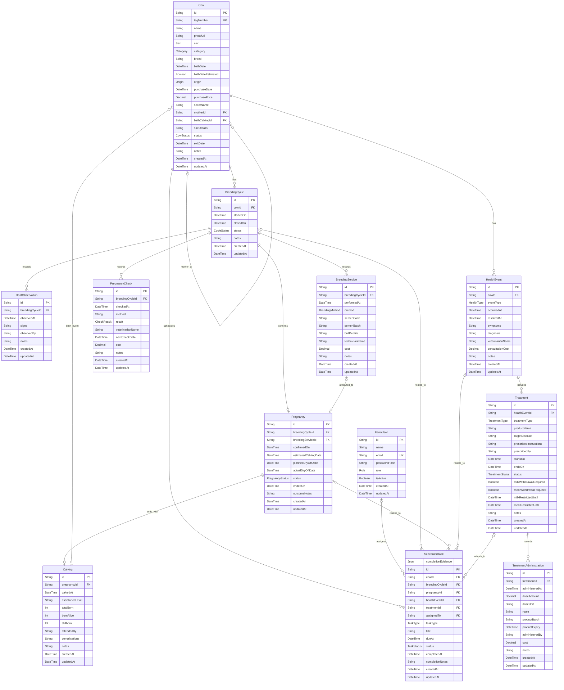

# Cow Farm Database

```mermaid
erDiagram
    Cow ||--o{ BreedingCycle : has
    Cow o|--o{ Cow : mother_of
    Calving o|--o{ Cow : birth_event
    BreedingCycle ||--o{ HeatObservation : records
    BreedingCycle ||--o{ BreedingService : records
    BreedingCycle ||--o{ PregnancyCheck : records
    BreedingCycle ||--o| Pregnancy : confirms
    BreedingService o|--o| Pregnancy : attributed_to
    Pregnancy ||--o| Calving : ends_with
    Cow ||--o{ HealthEvent : has
    HealthEvent ||--o{ Treatment : includes
    Treatment ||--o{ TreatmentAdministration : records
    Cow ||--o{ ScheduledTask : schedules
    FarmUser o|--o{ ScheduledTask : assigned
    BreedingCycle o|--o{ ScheduledTask : relates_to
    Pregnancy o|--o{ ScheduledTask : relates_to
    HealthEvent o|--o{ ScheduledTask : relates_to
    Treatment o|--o{ ScheduledTask : relates_to
    FarmUser {
        String id PK
        String name
        String email UK
        String passwordHash
        Role role
        Boolean isActive
        DateTime createdAt
        DateTime updatedAt
    }
    Cow {
        String id PK
        String tagNumber UK
        String name
        String photoUrl
        Sex sex
        Category category
        String breed
        DateTime birthDate
        Boolean birthDateEstimated
        Origin origin
        DateTime purchaseDate
        Decimal purchasePrice
        String sellerName
        String motherId FK
        String birthCalvingId FK
        String sireDetails
        CowStatus status
        DateTime exitDate
        String notes
        DateTime createdAt
        DateTime updatedAt
    }
    BreedingCycle {
        String id PK
        String cowId FK
        DateTime startedOn
        DateTime closedOn
        CycleStatus status
        String notes
        DateTime createdAt
        DateTime updatedAt
    }
    HeatObservation {
        String id PK
        String breedingCycleId FK
        DateTime observedAt
        String signs
        String observedBy
        String notes
        DateTime createdAt
        DateTime updatedAt
    }
    BreedingService {
        String id PK
        String breedingCycleId FK
        DateTime performedAt
        BreedingMethod method
        String semenCode
        String semenBatch
        String bullDetails
        String technicianName
        Decimal cost
        String notes
        DateTime createdAt
        DateTime updatedAt
    }
    PregnancyCheck {
        String id PK
        String breedingCycleId FK
        DateTime checkedAt
        String method
        CheckResult result
        String veterinarianName
        DateTime nextCheckDate
        Decimal cost
        String notes
        DateTime createdAt
        DateTime updatedAt
    }
    Pregnancy {
        String id PK
        String breedingCycleId FK
        String breedingServiceId FK
        DateTime confirmedOn
        DateTime estimatedCalvingDate
        DateTime plannedDryOffDate
        DateTime actualDryOffDate
        PregnancyStatus status
        DateTime endedOn
        String outcomeNotes
        DateTime createdAt
        DateTime updatedAt
    }
    Calving {
        String id PK
        String pregnancyId FK
        DateTime calvedAt
        String assistanceLevel
        Int totalBorn
        Int bornAlive
        Int stillborn
        String attendedBy
        String complications
        String notes
        DateTime createdAt
        DateTime updatedAt
    }
    HealthEvent {
        String id PK
        String cowId FK
        HealthType eventType
        DateTime occurredAt
        DateTime resolvedAt
        String symptoms
        String diagnosis
        String veterinarianName
        Decimal consultationCost
        String notes
        DateTime createdAt
        DateTime updatedAt
    }
    Treatment {
        String id PK
        String healthEventId FK
        TreatmentType treatmentType
        String productName
        String targetDisease
        String prescribedInstructions
        String prescribedBy
        DateTime startsOn
        DateTime endsOn
        TreatmentStatus status
        Boolean milkWithdrawalRequired
        Boolean meatWithdrawalRequired
        DateTime milkRestrictedUntil
        DateTime meatRestrictedUntil
        String notes
        DateTime createdAt
        DateTime updatedAt
    }
    TreatmentAdministration {
        String id PK
        String treatmentId FK
        DateTime administeredAt
        Decimal doseAmount
        String doseUnit
        String route
        String productBatch
        DateTime productExpiry
        String administeredBy
        Decimal cost
        String notes
        DateTime createdAt
        DateTime updatedAt
    }
    ScheduledTask {
        Json completionEvidence
        String id PK
        String cowId FK
        String breedingCycleId FK
        String pregnancyId FK
        String healthEventId FK
        String treatmentId FK
        String assignedTo FK
        TaskType taskType
        String title
        DateTime dueAt
        TaskStatus status
        DateTime completedAt
        String completionNotes
        DateTime createdAt
        DateTime updatedAt
    }
```

UUID primary keys; PostgreSQL date/timestamptz; numeric money and dose fields. See migrations for partial indexes and CHECK constraints.
